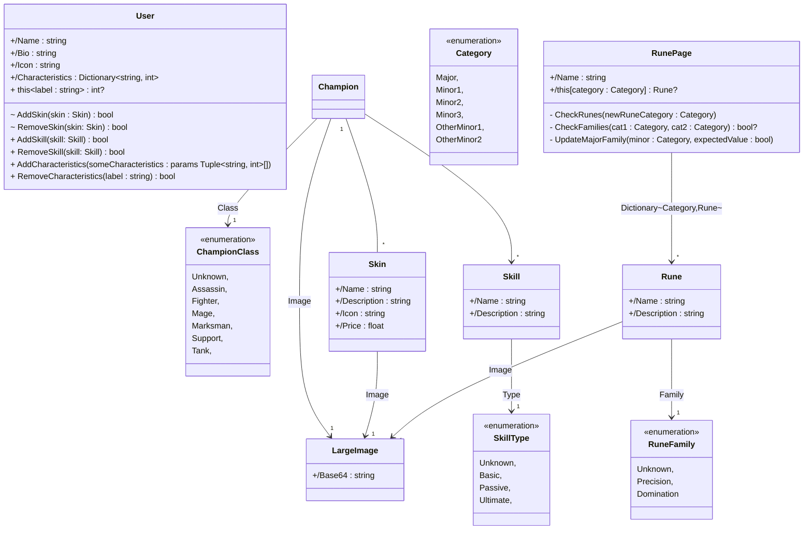

  
    
---

&nbsp; 
&nbsp; 
&nbsp; 
&nbsp; 
&nbsp; 

### API - ALL IN !

# Répartition du gitlab

[**Sources**](Sources) : **Code de l'application**

[**Documentation**](Documentation) : **Documentation de l'application**

👉 [**Solution de l'application**](Sources/AllIn.sln)

## Diagramme de classes du modèle

<right>

