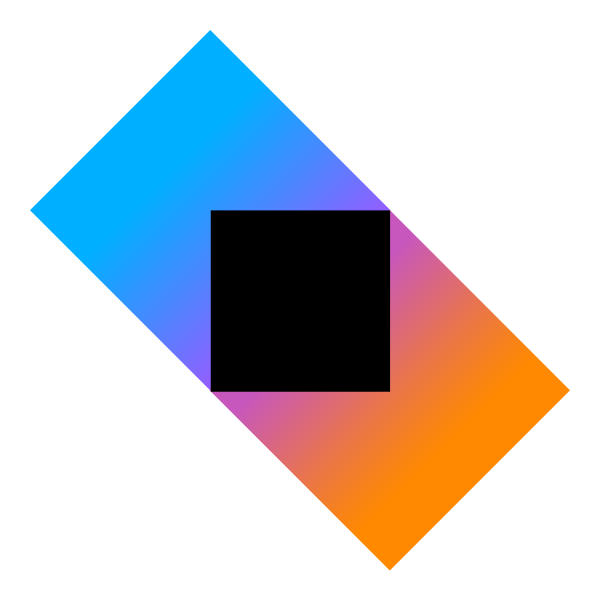

  
    
---

&nbsp; 
&nbsp; 
&nbsp; 
&nbsp; 

---

[Présentation](#api---all-in) | [Répartition du dépôt](#répartition-du-gitlab) | [Technologies](#technologies) | [Outils](#outils) | [Controllers](#controllers) | [Deploiement](#déploiement) | [Wiki](https://codefirst.iut.uca.fr/git/AllDev/Gestion_de_projet/wiki)

### API - ALL IN !

**Contexte** : Api pour le projet universitaire de troisieme année (B.U.T Informatique de Clermont-Ferrand) intitulé *All In*.
 

**Description** : Ce dépôt contient l'ensemble du code de l'API pour la partie back-end de l'application *ALL IN* et la connexion à la base de données.
 

**Utilité** : :information_source: Son rôle est de simplifier le processus de développement des interfaces clients d'*All In*, que ce soit pour les applications iOS, Android ou tout autre futur client.
 

# Répartition du gitlab

[**Sources**](Sources) : **Code de l'application**

[**Documentation**](Documentation) : **Documentation de l'application**

# Technologies

 **KTOR**

- L'API est réalisée avec le framework Ktor, en raison des nombreux avantages qu'il offre. Sa facilité de prise en main, sa légèreté en termes de code, son utilisation d'un langage moderne (*Kotlin*), ainsi qu'une documentation détaillée et complète du framework.

 **PostgreSQL**

- Pour stocker les données des utilisateurs et des paris, nous utilisons une base de données PostgreSQL sur laquelle l'API s'appuie pour récupérer et enregistrer des données. En raison de sa conformité aux dernières normes SQL, garantissant une compatibilité et une évolutivité optimales, ainsi que de son efficacité à gérer un grand nombre de données.
 

# Outils

Pour la partie API, nous utilisons plusieurs outils et méthodes :

### Swagger

L'utilisation d'un Swagger dans le développement d'une API facilite la gestion, la documentation et la compréhension des endpoints, optimisant ainsi le processus de création et favorisant une collaboration efficace entre les équipes.
 

Lien vers le Swagger de l'API All In :  [Swagger All IN]()

### JWT

Pour renforcer la sécurité en permettant une authentification et une autorisation fiables, nous utilisons la bibliothèque JWT (JSON Web Tokens). Cela garantit l'intégrité des données échangées et facilite la gestion efficace et décentralisée des sessions utilisateur.

### DTO et Mapper

Afin de garantir la sécurité des échanges d'informations entre notre application et la base de données, nous avons utiliser des mappers et des DTO. 
Ils sont essentiels pour une transmission sécurisée des données entre les différentes couches de l'application.
Contribuent ainsi à maintenir l'intégrité et la cohérence des données tout au long du processus.

# Controllers

Notre API est organisée en utilisant une séparation logique des routes par le biais de controllers. 
Deux controllers principaux structurent notre application :

### Controller User :walking:

Ce controller est dédié à l'authentification et aux données liées à l'utilisateur.

### Controller BET :money_with_wings:

Le controller BET gère toutes les opérations liées aux paris. Il permet de récupérer, ajouter, modifier et supprimer des paris. 

:white_check_mark: Cette séparation permet une gestion plus claire et modulaire des fonctionnalités de l'API, facilitant la maintenance et l'extension de notre système.

# Déploiement

Le déploiement est réalisé sur Code First via les services **Drone** et **Runner** ! :rocket:

Lien de l'API sur codefirst : [API All In](https://codefirst.iut.uca.fr/containers/AllDev-api)

© AllDev - API

